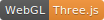

# 前端周刊 第13期（20180331）

## 新鲜事
- [React v16.3.0: New lifecycles and context API](https://reactjs.org/blog/2018/03/29/react-v-16-3.html?utm_source=mife&utm_medium=article&utm_campaign=frontendweekly&utm_term=news)：RT 
- [V8 release v6.6](https://v8project.blogspot.hk/2018/03/v8-release-66.html?utm_source=mife&utm_medium=article&utm_campaign=frontendweekly&utm_term=news)：新版 V8 引擎将伴随 Chrome 66 一起升级，`Array#reduce` 性能大幅提升 
- [Announcing TypeScript 2.8](https://blogs.msdn.microsoft.com/typescript/2018/03/27/announcing-typescript-2-8/?utm_source=mife&utm_medium=article&utm_campaign=frontendweekly&utm_term=news)：RT 

## 前端提高
- [A list of cool Chrome DevTools Tips and Tricks](https://flaviocopes.com/chrome-devtools-tips/?utm_source=mife&utm_medium=article&utm_campaign=frontendweekly&utm_term=tips)：Chrome 开发者工具技巧 
- [What’s new in ES2018?](https://slidr.io/mathiasbynens/what-s-new-in-es2018?utm_source=mife&utm_medium=article&utm_campaign=frontendweekly&utm_term=tutorial) 
- [Unit Testing in JavaScript](https://www.taniarascia.com/unit-testing-in-javascript/?utm_source=mife&utm_medium=article&utm_campaign=frontendweekly&utm_term=tutorial)：入门 TDD 开发 

## 值得关注
- [driver.js](http://kamranahmed.info/driver)：页面引导效果库【[GitHub repo](https://github.com/kamranahmedse/driver.js?utm_source=mife&utm_medium=article&utm_campaign=frontendweekly&utm_term=code)】  
- [react-testing-library](https://github.com/kentcdodds/react-testing-library?utm_source=mife&utm_medium=article&utm_campaign=frontendweekly&utm_term=github)：React DOM 测试工具 
- [Nerv](https://github.com/NervJS/nerv?utm_source=mife&utm_medium=article&utm_campaign=frontendweekly&utm_term=github)：又一个类 React 组件框架  
- [Pure CSS Saturn Hula Hooping](https://codepen.io/jcoulterdesign/pen/BrdPaw?utm_source=mife&utm_medium=article&utm_campaign=frontendweekly&utm_term=code)：CSS 做的土星呼啦圈 
- [luxe](https://luxeengine.com/?utm_source=mife&utm_medium=article&utm_campaign=frontendweekly&utm_term=github)：A lovingly hand crafted cross platform game engine

## 课外读物
- [TensorFlow.js](https://js.tensorflow.org/?utm_source=mife&utm_medium=article&utm_campaign=frontendweekly&utm_term=demo)：RT 
- [Mosaic](https://codepen.io/Mamboleoo/pen/vRYxQy?utm_source=mife&utm_medium=article&utm_campaign=frontendweekly&utm_term=github) 
- [Spatial Hash Canvas Particles](https://codepen.io/jackrugile/full/JLOXWZ/?utm_source=mife&utm_medium=article&utm_campaign=frontendweekly&utm_term=demo) 
- [Path Flow aka Mesh Path Deformation Modifier](https://zz85.github.io/threejs-path-flow/flow.html?utm_source=mife&utm_medium=article&utm_campaign=frontendweekly&utm_term=demo)：Three.js 循环路径【[GitHub repo](https://github.com/zz85/threejs-path-flow?utm_source=mife&utm_medium=article&utm_campaign=frontendweekly&utm_term=demo)】  
- [kin and eye rendering in WebGL](https://www.derschmale.com/lab/doodles/blueeyes/build/?utm_source=mife&utm_medium=article&utm_campaign=frontendweekly&utm_term=demo)  

-- EOF --
