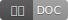

# 前端周刊 第20期（20180727）

## 推荐

- [印记中文——印记中文出品，唯一与官方文档同步的中文文档](https://docschina.org/?utm_source=mife&utm_medium=article&utm_campaign=mifeweekly&utm_term=doc) 

## 新鲜事
- [GitHub Dashboard 重构放弃使用 jQuery](https://mp.weixin.qq.com/s/BmTxOBA1UaX7OjQlB7BhvQ?utm_source=mife&utm_medium=article&utm_campaign=mifeweekly&utm_term=news) 
- [A milestone for Chrome security: marking HTTP as “not secure”](https://www.blog.google/products/chrome/milestone-chrome-security-marking-http-not-secure/?utm_source=mife&utm_medium=article&utm_campaign=mifeweekly&utm_term=news) 

## 前端提高

- [[译]如何使用React生命周期方法](https://juejin.im/post/5b59d1c8e51d4519455846e0?utm_source=mife&utm_medium=article&utm_campaign=mifeweekly&utm_term=tutorial) 

## 值得关注

- [JS验证库](https://github.com/imbrn/v8n?utm_source=mife&utm_medium=article&utm_campaign=mifeweekly&utm_term=github) 

## 课外读物

- [这 10 款好用的 Chrome 扩展，能让你的浏览器好用很多倍](https://mp.weixin.qq.com/s/PHvIjo-hblMPXkPgnCqrYg?utm_source=mife&utm_medium=article&utm_campaign=mifeweekly&utm_term=tools) 

-- EOF --