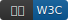

# 前端周刊 第1期（20180101）

## 新鲜事
-

## 前端提高
-

## 值得关注
-

## 课外读物
-

[//]: # (分类图标
    news
    video
    tutorial
    code
    demo
    opinion
    tips
    tools
    book
    doc
    github
    w3c
    mdn
    logo
  )
[//]: # (通用追踪后缀 ?utm_source=mife&utm_medium=article&utm_campaign=frontendweekly&utm_term=tool
  utm_source=mife
  &utm_medium=article
  &utm_campaign=frontendweekly
  &utm_term=tool
  )

-- EOF --